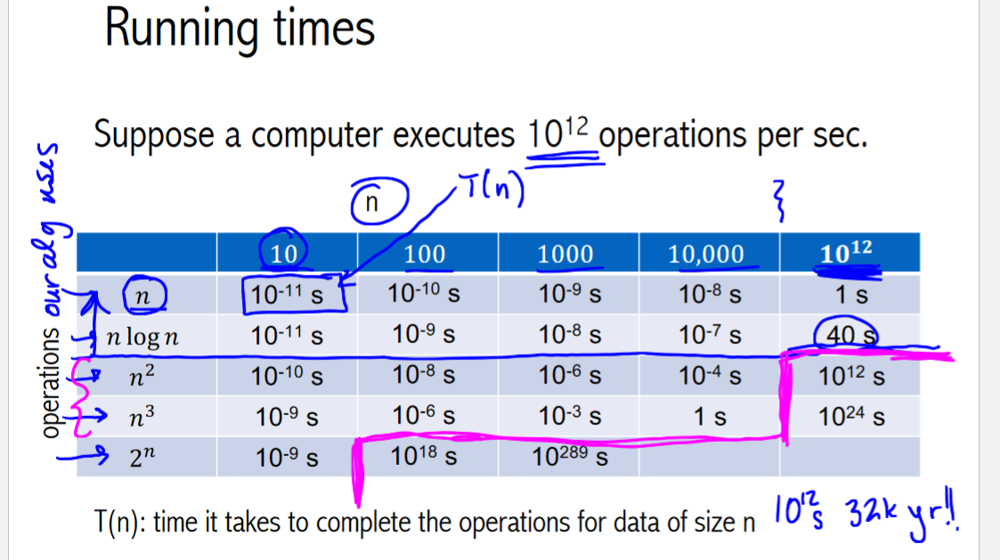

# CPSC221

[Course Modules](https://canvas.ubc.ca/courses/78028/modules#module_505710)

# Description

Hello, my name is Alex and I am currently a 4th year UBC student going into my 3rd year studying statistics and cs with a minor in commerce. In my free time I enjoy working out at the birdcoop, bouldering, and being an active member of the best fraternity on this campus. In this series of videos I am going to walk with you guys through CPSC221 as taught by UBC in fall 2021 when I took the course. 

github link to course notes

instagram: @nosuchthingasagrinius

Please don’t hesitate to reach out with questions and comments: grinius.alex@gmail.com

# Introduction

Hello, my name is Alex and I am currently a 4th year UBC student going into my 3rd year studying statistics and cs with a minor in commerce. In my free time I enjoy working out at the birdcoop, bouldering, and being an active member of the best fraternity on this campus. In this series of videos I am going to walk with you guys through CPSC221 as taught by UBC in fall 2021 when I took the course. 

My mark in the course was a 72, the course average was 83. I failed to complete multiple assignments and whiffed the rest.

My goal with this series of videos is to regain my own familiarity with the course material and understand it better than I did when I was being testing on it. I am going to do this by making a series of 10-15 min videos going through all the course topics week by week and then maybe going over a few of the assignments at the end. 

Outline: reasoning about code, classic data structures, graph algorithms 

There’ll be links to some trash tier notes in the description, the course was taught in C++ but I’m going to use python because it’s like writing functional pseudo-code 

# Week 1 & 2

## 1.2 Reasoning about code

Why? Because we want reason about which algorithms are best and why.

Correctness, runtime, and space complexity

Correctness: self explanatory - does it work? prove it.

Runtime: roughly a measure of how many operations a computer needs to take to complete the algorithm

Space complexity: how much working memory is your algorithm going to use? An algorithm that makes 6 copies of an array is going to use more memory than one that dosen’t make copies 

Runtimes: 

Expressed as a function of n where n is the arbitrary number of objects that the algorithm has to process. The function is positive as you can’t have negative numbers of objects or negative time. Uses big O notation → link in description for summary of that. 



## 2.1 Asymptotics

Basically is there an easy to understand function that is always greater than or equal to whatever complex function defines the runtime for our algorithm. We do this because comparing two easy to understand functions is easier than comparing two more complex functions and will typically give similar results - there’s some complex reasons why this is true that I might explain later… or I might not, figure it out yourself bud

Here is a fancy definition of them, the ordering by speed, and a rough guide to how to construct them. These were stolen from UBC’s slides, I did none of this myself and will probably not go into details - again, figure it out for yourself. 


## 2.2 Correctness

How do you prove an algorithm works properly? Typically an algorithm that operates on multiple objects will have a loop somewhere in the code. Our goal is to show that by the end of the looping, the algorithm has had the desired outcome. 

1. Base Case: starting place for the algorithm
2. Inductive Step: what changes after each step in the loop and what does not (loop invariant) 
3. End: how does the ‘doing’ of all the inductive steps lead to the desired outcome - this is the ‘proving’ part

The math word for this process is proof by induction - google it if you care. 

We do it this way because we can easily guess where it starts, step 1, then stumble through reasoning through one step of the process , step 2, and then figure out how it reaches the goal, step 3. We’re building from a starting place to the end goal - logical eh? I won’t go into details on how to do step 3, the proof - you can google it yourself. 

## 2.3 Selection Sort

```python
def selection_sort(o: list):
"""sort list o using selection sort algorithm"""
	for i in range(0,len(o)):
		min_val_index = find_min(o, i)
		temp = o[i]
		o[i] = o[min_val_index]
		o[min_val_index] = temp

def find_min(o: list, i: int):
"""find index of first instance of min val in (o[i],o[n])"""
	loc = i
	for j in range(i + 1, len(o)):
		if o[j] < o[loc]:
			loc = j
	return loc
```

Aight lets go over this example, I am going to outline the proof without doing the hard work - if you’re taking the course, that’s your job. 

There are two algorithms at work here, selection_sort and find_min and we’ve got to work through both of them → remember our proof of selection_sort correctness and runtime analysis depends on our proof of find_min correctness and runtime analysis. 

The proofs aim to support those function description comments.

Correctness: 

find_min: 

1. we are given a list of integers, i = loc = location of current min, j = i + 1 = first object to compare to current min
2. the inductive step is each step of the for loop. We start each loop with loc = location of first instance of the min value between index i and index j, j = index of object we intend to compare to the current min - notice that this is true for the initial conditions and the end goal of the functions
3. as we go though each step, if the current object we are considering is smaller than the current min we set the current min to that object then go to compare the next object. Clearly, by the time we’ve gone through each object, we will be left with loc = the location of the first occurrence of the min value.  It’s always going to be the first instance because if we are comparing two objects that are equal, that if statement will evaluate to false and the location will stay as that first occurrence. 

selection_sort:

1. we are given a list that is unsorted, i = 0 = index we are analysing from
2. in each step of this for loop, we find the index of the min value then swap that value with the index we are currently analysisng, we know find_min works so after each loop o[i] = the ith smallest value. o[0:i] are sorted, o[i+1:n] are unsorted 
3. By going through objects until the last one (i = n) we construct a list of sorted elements. 

Runtime: 

1. find_min takes n-i time to run as we are analysing each item between n and i once and there are n - i items
2. each step of selection sort takes some constant time to swap elements and the time to find_min. The sum of each step is equal to the sum of the first n integers as n-i goes from n (i = 0) to 0. Attempt to understand the image in the notes for more details. 


# Week 3

### 3.1 Insertion Sort


Lets look into what this function does. First we have a temporary variable that holds the value that we’re currently interested in, then we set j to the index of that value. The while loop goes backwards along candy from loc setting the value of each index j to the value of the index before that. It does this until j reaches 0 (it’s at the start of the array) or the next value to shift is less than the value we’re interested in. 

So what does this function do, it takes a value at some loc and slides all values in 0≤ the index of the first value smaller than our value of interest < loc  and shifts (or slides) them forward by one index. Then our value is inserted. 

by the end of this function the values in A[0,j-1] are less than A[j] and all the values in A[j+1,loc] are larger than A[j].

What is the run time? We compare A[loc] to a portion (or all) of the values in A[0,loc-1], therefore this function runs in linear time w.r.t loc or big o of loc theta(loc). 

Already we can see how this can be used in a sorting function. 

### 3.2 Intro to Memory


To turn our slide function into a sorting algorithm, we just need to slide every value into it’s correct place. 

Proof for correctness: variable i goes from {1,n}, the invariant is that everything in A[0,i-1] is sorted. This is true in the base case of i = 1, as A[0,1-1] is sorted due to it being only one element. The inductive step assumes the LI holds, and given the correctness of slide, the slide function will insure that A[0,i] is sorted after its run. Thus when i is incremented by one, the LI is restored. The function terminates when i = n, and the LI gives us that A[0, i - 1 = n - 1] is sorted and that’s the whole array. 

A brief note on time complexity: the best case for this algorithm is that it’s already sorted and slide doesn’t have to do any work, running though each element once gives a run time of O(n). The worse case scenario is the list is in reverse order and you’ve got to compare each element to every element that came before it, giving O(n^2). 


What is this? 

1. Well each Node appears to have a piece of data associated with it and a pointer (*) to some next Node. A pointer is a reference to a place in memory so this pointer points to some ‘next’ piece of data somewhere in memory
2. Line 5 is a constructor that sets [Node.data](http://Node.data) = nData and can be given a next node, but if none is provided, next will be set to Null. 
3. The use of template allows us to parameterize a type, meaning that the data that is stored can be of any type that we choose. 
4. A struct is a collection of public variables 

Pointer basics:

```cpp
int *p //memory address of an int
//p = NULL is a valid statement

p = &x //& = memory address operator
//now p is pointing to the addess of x

*p = 200 //* = dereference operator
//This sets the value at memory address p to 200

q = new int; //allocate space for an int
*q = 9; //put the value of 9 in the memory address pointed to by q
q = NULL //memory leak, no way to reference that 9 in memory
//instead do 
q = new int; //allocate space for an int
*q = 9; //put the value of 9 in the memory address pointed to by q
delete q; //frees up memory at address q to be rewritten 
q = NULL; //now we can set the pointer to null without worry
```

Memory leak: when all pointers to a piece of memory are removed, that data is lost and not flagged to be over written. 

Segmentation fault: When you try to access a piece of data via a pointer for which no memory has been allocated (like if I didn’t use ‘new int’ in the code above)

### 3.3 Linked Lists

Linked lists are collections of Nodes where each node points to the next one in the list. Only a reference to the first node, called the head, needs to be kept as each value is chained to that one. Unlike an array, the data in a linked list doesn’t have to be right next to each other in memory, making them more flexible. 


# Week 4

### 4.1 More linked lists

```cpp
struct Node{
	LIT data;
	Node * next;
	Node(LIT newData):data(newData),next(NULL){}
};

void insert_front(Node *curr, LIT e){
	Node *nn = new Node(e);
	nn->next = curr
	curr = nn
}

void print_reverse(Node *curr){
	if (curr != NULL){
		print_reverse(curr->next);
		cout << curr->data;
	}
}

void print_reverse_odds(Node *curr){
	//no nodes
	if (curr == Null){
		return;
	} if (curr->next == Null)
		cout<<curr->data;
		return;
	} else {
		printe_reverse_odds(curr->next->next);
		cout<<curr->data
	}
}

```


### 4.2 Stacks